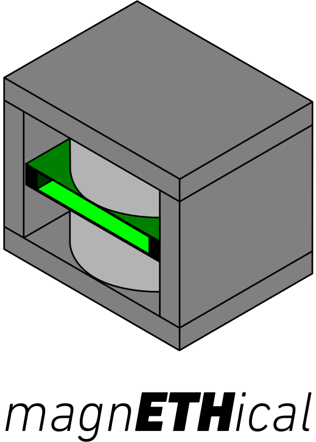
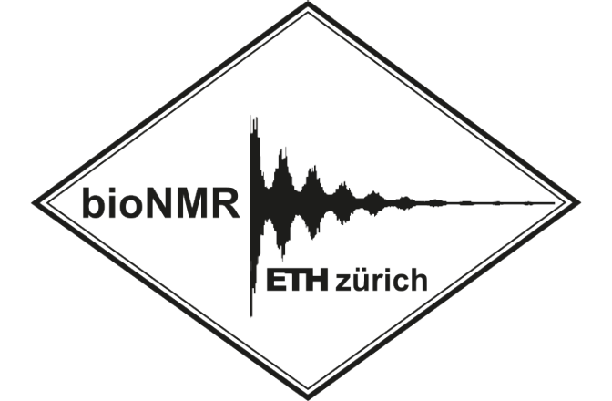

  

Building a 25MHz NMR spectrometer 01.04.2023 - 30.09.2023

   
  

---

 magnETHical is a simple low-cost low-field 0.6T NMR spectrometer based on a RedPitaya and custom hardware. This repository contains everything to build your own. This includes simulations, specifications, full hardware descriptions and CAD designs, Python control code and reproducible measurement results.

## 📝 Table of Contents
- [📝 Table of Contents](#-table-of-contents)
- [🧐 About ](#-about-)
- [🏁 Getting Started ](#-getting-started-)
  - [✅ Prerequisites](#-prerequisites)
  - [🔧 Hardware](#-hardware)
  - [🖥️ Software](#️-software)
- [⚙️ Running the tests ](#️-running-the-tests-)
- [🧪 Usage ](#-usage-)
- [⛏️ Built Using ](#️-built-using-)
- [✍️ Authors ](#️-authors-)
- [🎉 Acknowledgements ](#-acknowledgements-)

## 🧐 About 
Since the discovery of the Zeeman effect in 1896 and its first use for spectroscopy in the 1940s a lot of technological advancements enabled the capture of increasingly better spectrums and the development of increasingly advanced techniques. Unfortunately, this advancement isn't cheap. Modern NMR spectroscopes cost a fortune, limiting access to this technology to well-funded research institutes, keeping out institutes from the southern hemisphere and limiting its exposure.

magnETHical seeks to provide a low-cost low-field NMR system not only capable of relaxometry but also spectroscopy for a price about an order of magnitude lower than existing devices. It's an open-source well-documented system that can be fully assembled in-house and consists of flexible components that are easily and readily available. 90% of the current ~10k€ price tag is comprised of the magnet with room for at least halving the price in the foreseeable future.

This repository seeks to provide everything needed to order, assemble and operate your own magnETHical NMR spectrometer.

## 🏁 Getting Started 

### ✅ Prerequisites
Great care has been taken to only use widely available free and open-source software so that this project may be built by anyone without any software licensing fees.

Throughout this README and the linked READMEs below a basic familiarity with the used software is assumed. However, anyone with some time on their hands should be able to follow them without much trouble after a very basic introduction to these programs. If you have trouble understanding any of the instructions, please feel free to open an issue - it's likely an error in this documentation and not on your side.

### 🔧 Hardware
The hardware consists of five main parts
- the [magnet](),
- the [digital signal generation, reception and processing board](),
- the [analogue amplification board](),
- the [electrical shimming system]() and
- the [NMR probe]().

Each of these parts can be built, assembled and verified independently of each other. For instructions on building these sub-systems, see the respective READMEs linked in the list above.

With all parts built, the final system needs to be assembled according to the following schematic.

The final assembly then looks something like this

### 🖥️ Software
Having built the hardware above the [Python control software]() can be used to capture spectra. See the linked article for a detailed guide on how to set up the software. We recommend a dedicated computer setup to run the experiments.

## ⚙️ Running the tests 
The simplest test is running marcos test without/with water. measure coil ringing

Explain how to run the automated tests for this system.

## 🧪 Usage 
To record spectra...

How to use the software/hardware. Recomenndations on analysis (Jupyter...)
Add notes about how to use the system.

## ⛏️ Built Using 

- Hardware
  - [KiCAD](https://www.kicad.org/) - ECAD for PCB Design
  - [FreeCAD](https://www.freecad.org/) - MCAD for Enclosures
  - [OpenSCAD](https://openscad.org/) - Parametric CAD for the probe
  - [LTSpice](https://www.analog.com/en/design-center/design-tools-and-calculators/ltspice-simulator.html) - Simulation of electronic circuits
- Software
  - [MaRCoS](https://github.com/vnegnev/marcos_extras) - Low-level control software for the RedPitaya and FPGA
  - [NumPy](https://numpy.org/)/[SciPy](https://scipy.org/)/[Matplotlib](https://matplotlib.org/) - High-level control software and analysis
- Documentation
  - [LaTeX](https://www.latex-project.org/) - Advanced typesetting system
  - [Sphinx](https://www.sphinx-doc.org) - Beautiful documentation

## ✍️ Authors 
- [Maximilian Stabel](mailto:mstabel@student.ethz.ch) - Idea & Initial work including Hardware & Software

## 🎉 Acknowledgements 
- Supervisor
  - [**Takuya Segawa**](https://chab.ethz.ch/forschung/institute-und-laboratorien/LPC/personen/people-details.html?persid=120573) for his supervision and encouragement
- Professors
  - [**Roland Riek**](https://chab.ethz.ch/en/the-department/people/faculty/person-detail.rriek.html) for giving me this opportunity
  - [**Sebastian Kozerke**](https://biomed.ee.ethz.ch/institute/People/person-detail.html?persid=61641) for taking me in as his Master's student
- Support
  - [**Alexander Däpp**](https://ssnmr.ethz.ch/the-group/people/person-detail.html?persid=147372) for his support and patience with the RF hardware
  - [**Tiago Ferreira das Neves**](https://chab.ethz.ch/en/the-department/people/a-z/person-detail.MjU3NzM4.TGlzdC82MDEsLTIxMzAxOTI4MDM=.html) for his electronics support

  

