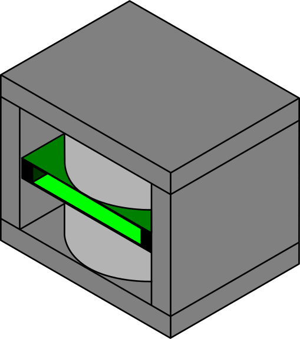

<div align="center">
  <a href="" rel="noopener">
 </a>
</div>

<div align="center"><h3>Spectrometer</h3></div>

<div align="center">

  [![status][status-badge]]() 
  [![python - version][python-badge]][python]
  [![project - hatch][hatch-badge]][hatch]
  [![linting - Ruff][ruff-badge]][ruff]
  [![code style - Black][black-badge]][black]
  [![types - Mypy][mypy-badge]][mypy]
  [![License][license-badge]][license]

</div>

---

<div align="center"> Spectrometer is the Python interface library for the magnETHical NMR spectrometer. Its aim is to make usage of the hardware as simple and convenient as possible.</div>

# magnETHical

## 📝 Table of Contents
- [magnETHical](#magnethical)
  - [📝 Table of Contents](#-table-of-contents)
  - [🧐 About ](#-about-)
  - [🏁 Getting Started ](#-getting-started-)
    - [✅ Prerequisites](#-prerequisites)
    - [🔧 Installation](#-installation)
      - [Python \& Git](#python--git)
      - [Virtual Environment](#virtual-environment)
        - [Manual environment](#manual-environment)
        - [Automatic creation using `Hatch`](#automatic-creation-using-hatch)
      - [Spectrometer Packet](#spectrometer-packet)
  - [⚙️ Running the tests/scripts/demo](#️-running-the-testsscriptsdemo)
  - [🧪 Usage ](#-usage-)
  - [⛏️ Built Using ](#️-built-using-)
  - [✍️ Authors ](#️-authors-)
  - [Notes](#notes)
  - [Roadmap](#roadmap)

## 🧐 About <a name = "about"></a>
The magnETHical spectrometer is a low-cost low-field home-made NMR spectrometer developed at ETH Zürich. This project is providing an interface for setting up the spectrometer software on the RedPitaya 122-16 (SDRLab) system, sending and recording pulse sequences.

## 🏁 Getting Started <a name = "getting_started"></a>

### ✅ Prerequisites
We assume you have [built and assembled the necessary hardware](../../hardware/) and that you have a Linux computer in front of you (preferably running a RedHat-flavoured system like RHEL, Fedora, CentOS, ...) that is connected to the RedPitaya through Ethernet (i.e. you know its IP address).

The RedPitaya should automatically get an IP address assigned by the router (i.e. DHCP is enabled by default). If you connect your laptop directly to the RedPitaya you need to either run your own DHCP server or you need to statically configure the IP address through the serial USB interface of the RedPitaya. If you don't know how, please look at [my MaRCoS documentation](../marcos/README.md#connect-through-serial). You don't need to follow all of the instructions, configuring the IP address is enough to use this software. If you'd like to run your own DHCP server, there are [detailed instructions for Arch available here](https://github.com/vnegnev/marcos_extras/wiki/guide_setting_marcos_up#13a-preparing-a-local-network-vlads-linux-method).

### 🔧 Installation
This library is a regular Python package and can be installed as such. Below you can find an opinionated step-by-step guide on how to set up a Python virtual environment, install the library and set up the spectrometer.

#### Python & Git

First step is to install Python on your system. This repository requires at least Python version 3.10 at the moment. If you're running Linux Python, should already be installed on your system. If it isn't, or if the version is too low it can be installed through the package manager of your Python distribution.

**Fedora**
```bash
$> sudo dnf install python3 git
```

**Ubuntu**
```bash
$> sudo apt install python3 git
```

**Windows**
For Windows you need to go to [the official Python homepage](https://www.python.org/downloads/) and download it from there. Make sure to check "Add the executable to PATH" in the installer. Other than that, accept the recommended defaults if you're unsure.

> **Note**  
> I don't recommend installing Python through the Microsoft Store. Due to packaging and sandboxing weird issues can crop up.

Git can be downloaded from [the official git-scm.com](https://git-scm.com/download/win) website as well. Simply download the appropriate installer for your system (nowadays probably 64bit), execute the downloaded binary and follow the instructions.

#### Virtual Environment

After installation of Python you should create a virtual environment for your project (if you haven't already). This encapsulates the packages and version from the rest of the system to make sure that e.g. a system update doesn't break your project. There are two main ways on going about this: manual creation or using a package manager. I recommend the former for scripts and "to try stuff" and the latter if you're creating your own package.

##### Manual environment
Open a terminal of your choice. In Linux this is often `Terminal`, `urxvt`, `Alacritty`, ... In Windows this is often `Powershell`, `Terminal` (if you installed `Terminal` from the Microsoft Store), or `cmd`. Try looking for it in your search bar (by pressing the Windows key and typing the word).

Now use `cd` to go to the folder you'd like to create your virtual environment in ad create it using Python:
```bash
$> cd ~
$> mkdir myproject
$> cd myproject
$> python3 -m venv .venv
```
This creates a hidden folder named `.venv` inside a new `myproject` folder and initializes your virtual environment.

To activate the virtual environment you need to execute the activation script.
**Linux**
```bash
$> source .venv/bin/activate
```

**Windows**
```bash
$> .venv/bin/activate.ps1     (for powershell)
$> .venv/bin/activate.bat     (for cmd)
```
> **Note**
> If you're using `Powershell` you might have to change the execution policy on your machine. The instructions on how to do that are printed, if the above command fails.

##### Automatic creation using `Hatch`
[Hatch](https://hatch.pypa.io/latest/) is the new standard package manager in Python. It is built on top of `pip` (which installs a package) to automatically figure out dependencies and manage virtual environments. To use it you first need to install it for the current user with `pip`:
```bash
$> python3 -m pip install hatch
```

With pip installed you can now go and create a new project somewhere you like. For example
```bash
$> cd ~
$> hatch new myproject
$> cd myproject
```

`Hatch` then creates a prefilled folder structure for your packet. Hatch always updates the current environment, if something changes in your configuration. All configuration options for your packet can be found inside the `pyproject.toml`. Look e.g. for the `dependencies`.

To activate the virtual environment in your terminal, simply run
```bash
$> hatch shell
```

For other commands, please refer to the [Hatch documentation](https://hatch.pypa.io/latest/intro/).

#### Spectrometer Packet
To install this project as a package you need to clone it to your local hard drive. Advanced users can do a partial clone, but I recommend a simple full clone. In the same directory as your project (i.e. `myproject` if you followed above) execute
```bash
$> git clone https://gitlab.ethz.ch/mstabel/nmr-spectrometer
```
To be able to use the `spectrometer` library in your project you now need to install it inside the virtual environment. Assuming you already activated it you can simply run pip on the corresponding directory:
```bash
$> python3 -m pip install ./nmr-spectrometer/software/spectrometer
```

If you're using hatch you can alternatively add it as a dependency to your `pyproject.toml` by adding the following line to your dependencies
```toml
dependencies = [
  ...
  spectrometer @ {root:uri}/nmr-spectrometer/software/spectrometer
  ...
]
```
The next time you run a hatch command, it will automatically update the virtual environment for you, you can force this ahead of time by e.g. running
```bash
$> hatch run true
```

If everything worked and you're inside the virtual environment you should be able to execute
```bash
$> magnethical --version
magnETHical v0.1.0
```

Congrats! The spectrometer control library is now installed!


## ⚙️ Running the tests/scripts/demo<a name = "tests"></a>

If you'd like to install this package to edit or run any of its contents, e.g. run the scripts, the demo or fix a bug you need to install the package in development mode. Since this package is built using `hatch` you need to first install hatch (if not already installed):
```bash
$> python3 -m pip install hatch
```

...

Now you can do a simple
```bash
$> hatch run demo
```

and a browser window with a demo `jupyter notebook` should open. 

Have fun exploring!

To run the unit tests simply run
```bash
$> hatch run test
```

Lastly,

```bash
$> hatch run demo
```
should open the documentation.

If you're curious on what these scripts actually execute take a look in the `pyproject.toml` file under `[tool.hatch.envs.default.scripts]`.

## 🧪 Usage <a name="usage"></a>
Recording spectra is relatively straight forward and well documented in the `docs/demo/full_demo.ipynb` Jupyter notebook and in the different `record_` and `process_` files inside the `scripts` folder. Here a short quickstart (taken from the `full_demo.ipynb`) with the necessary commands for sending a simple pulse sequence at 25.091MHz, sampling at 320kHz for 9us, waiting for 25us and then recording for 20ms:

```python
# Connect the server platform (i.e. the RedPitaya)
server = Server("192.168.1.100")

# Flash the FPGA bitstream (or "low level server")
server.flash_fpga()

# Compile the server on the spectrometer (or "high level server")
server.setup()

# Start the server on the spectrometer
server.start()

# Setup the spectrometer connection
connection_settings = ConnectionSettings(ip_address="192.168.1.100")

# Create the spectrometer object
spectrometer = Spectrometer(
    tx_freq=25_091_000,  # Center transmission frequency
    rx_freq=None,  # Receive frequency
    sample_rate=320_000,  # samples/second
    server_config=connection_settings,
)

# Connect to the spectrometer server
spectrometer.connect()

# Define and send the sequence
seq_simple = NMRSequence.simple(pulse_length_us=9, delay_us=25, record_length_us=20_000)
data = spectrometer.send_sequence(seq_simple, debug=True)

# Save
fid = FID1D(
    data=data,
    spectral_width=spectrometer.sample_rate,
    carrier_freq=0.0,
    observation_freq=spectrometer.rx_freq,
    label="1H",
    sample="Water",
    pulse="single_90_degree_pulse,length=9us,delay=30us",
    spectrometer="magnETHical v0.1",
)
fid.to_file("my_experiment.fid")

# Plot, e.g.
fig = fid.plot()

# Spectrum
spectrum = fid.spectrum()  # zero-fill, FFT, zero phase correction
fig = spectrum.hz.plot()
fig = spectrum.ppm.plot()
fit_spectrum, fitpeaks = spectrum.hz.fit()
peaks = spectrum.hz.peaks()
```

For further details look at the API reference available through `hatch run docs` which should build and display the documentation inside a webbrowser. If it doesn't open, the rendered version will be available in `docs/html/_build`.

## ⛏️ Built Using <a name = "built_using"></a>

- [MaRCoS](https://github.com/vnegnev/marcos_extras) - Low-level control software for the RedPitaya and FPGA
- [NumPy](https://numpy.org/)/[SciPy](https://scipy.org/)/[Matplotlib](https://matplotlib.org/) - High-level control software and analysis
- [Sphinx](https://www.sphinx-doc.org) - Beautiful documentation
- [nmrglue](https://www.nmrglue.com/) - Simple NMR processing and analysis functions

## ✍️ Authors <a name = "authors"></a>
- [Maximilian Stabel](mailto:mstabel@student.ethz.ch) - Idea & Initial work including Hardware & Software

## Notes

For analysis of later spectra:
- [`CCPNMR`](https://ccpn.ac.uk/)
- [`POKY`](https://github.com/pokynmr/POKY) is the successor of [SPARKY](https://www.cgl.ucsf.edu/home/sparky) by UCSF and the [`NMRFAM-SPARKY`](https://nmrfam.wisc.edu/nmrfam-sparky-distribution/) distribution
- [`spectrochempy`](https://www.spectrochempy.fr) looks promising (only Bruker, JCAMP, OPUS, OMNIC data)
- `penguins` (reads only Bruker data?)

Other noteworthy data formats:
- [`nmrML`](https://github.com/nmrML/nmrML) open NMR data format. read supported by NMRglue
- [`JCAMP-DX`](http://www.jcamp-dx.org/) Open NMR data format. Read supported by NMRglue

## Roadmap
- No further analysis capabilities planned beyond simple plotting of spectra and simple fit, everything else see Notes above
- [PySeq Support/FLOCRA](https://github.com/stockmann-lab/flocra-pulseq)
- Automatic Calibration and Shimming, see e.g. [MGH](https://github.com/stockmann-lab/mgh_marcos)

[status-badge]: https://img.shields.io/badge/status-active-success.svg
[python-badge]: https://img.shields.io/badge/python->=3.7-blue
[python]: https://www.python.org/downloads/
[hatch]: https://github.com/pypa/hatch
[hatch-badge]: https://img.shields.io/badge/%F0%9F%A5%9A-Hatch-4051b5.svg
[ruff]: https://github.com/charliermarsh/ruff
[ruff-badge]: https://img.shields.io/endpoint?url=https://raw.githubusercontent.com/charliermarsh/ruff/main/assets/badge/v0.json
[black]: https://github.com/psf/black
[black-badge]: https://img.shields.io/badge/code%20style-black-000000.svg
[mypy]: https://github.com/python/mypy
[mypy-badge]: https://img.shields.io/badge/types-Mypy-blue.svg
[license-badge]: https://img.shields.io/badge/license-GPL--3.0-orange.svg
[license]: /LICENSE