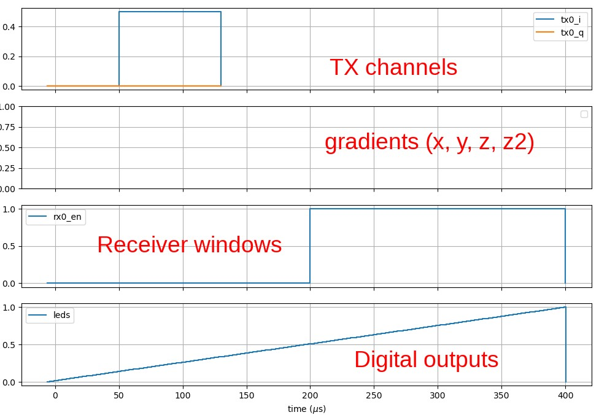
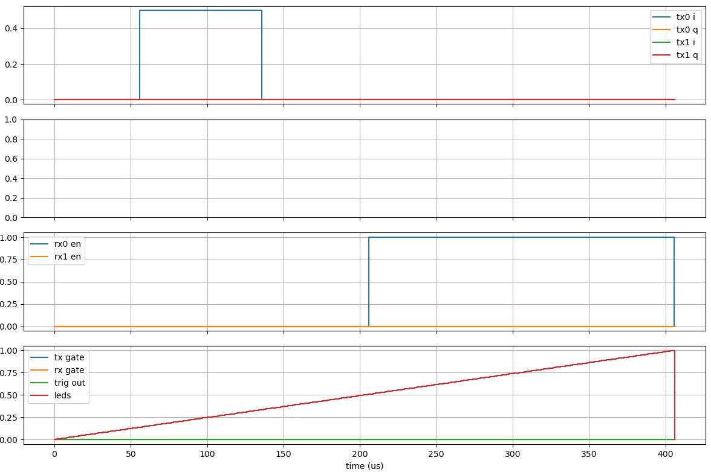
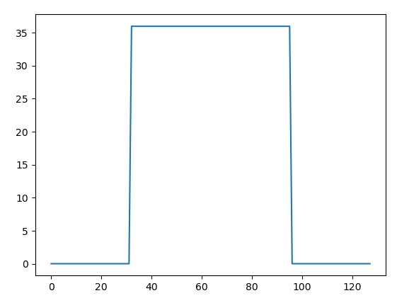
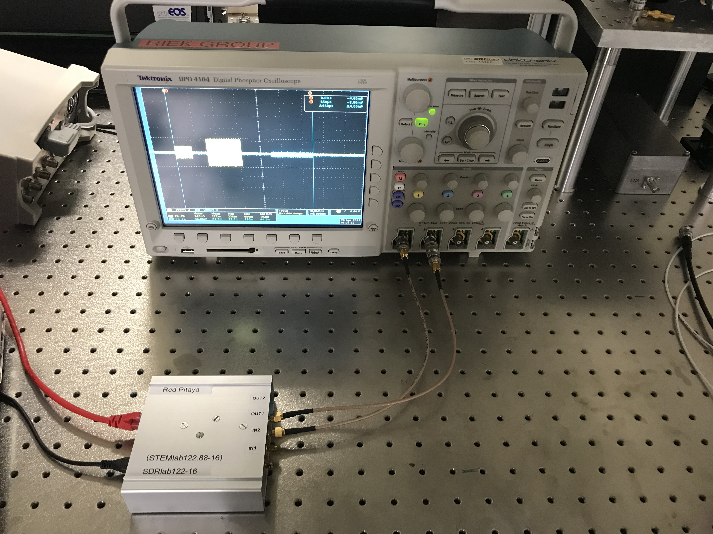
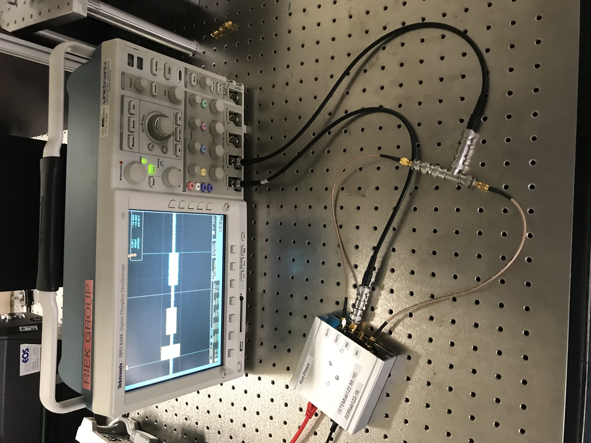

# MaRCoS

This README contains all instructions related to MaRCoS - specifically setup and experiment execution.

## Table of Contents <!-- omit in toc -->
- [MaRCoS](#marcos)
  - [Setup](#setup)
    - [Console / Laptop](#console--laptop)
      - [OS Setup](#os-setup)
      - [Python environment](#python-environment)
      - [Run unit tests](#run-unit-tests)
      - [Running the `marga` simulator](#running-the-marga-simulator)
    - [Red Pitaya](#red-pitaya)
      - [Flash the custom marcos Yocto image](#flash-the-custom-marcos-yocto-image)
      - [Alternatively: Flash the standard RedPitaya Image](#alternatively-flash-the-standard-redpitaya-image)
      - [Connect through serial](#connect-through-serial)
      - [Connect through Ethernet](#connect-through-ethernet)
      - [Start the server](#start-the-server)
      - [Test the server](#test-the-server)
      - [SD-Card usage](#sd-card-usage)
  - [Sequences](#sequences)
    - [My first experiment](#my-first-experiment)
      - [Creating the script](#creating-the-script)
      - [Running the script on the simulator](#running-the-script-on-the-simulator)
      - [Running the script on the RedPitaya](#running-the-script-on-the-redpitaya)
  - [Misc](#misc)


## Setup

### Console / Laptop

The current system uses `Fedora 38 Workstation`, but any modern Linux (recent!) like Ubuntu or Arch would work as well. Fedora was chosen for its extensive support, backing by RedHat, and wide use of its sibling CentOS in the scientific community, while still being more recent and modern with a quick release schedule without the drawbacks of a rolling release system.

After installation of the base system the [MaRCoS client](https://github.com/vnegnev/marcos_client) was set up according to the [tutorial in the wiki](https://github.com/vnegnev/marcos_extras/wiki/tut_set_up_marcos_software), _but_ in a new python (3.11.2) virtual environment as is best practice. An extended C & Electronics group was installed as well do ease development. In short:

#### OS Setup

**Fedora**:
- `sudo dnf group install -q --with-optional "Development Libraries" "Development Tools" "C Development Tools and Libraries" "Electronic Lab"`
**Arch**:
- `sudo pacman -S base-devel verilator cmake`

#### Python environment

- `git clone --recurse-submodules https://github.com/vnegnev/marcos_pack.git`
- `cd marcos_pack`
- `python -m ensurepip`
- `python -m pip install -U pip`
- `python -m venv .venv`
- `python -m install -U numpy scipy matplotlib msgpack`

To activate the Python environment in a terminal and use the installed packages execute (inside the `marcos_pack` folder):
- `source .venv/bin/activate`

#### Run unit tests

- `cd marcos_client`
- `cp local_config.py.example local_config.py`

Set contents to:

```python
ip_address = "localhost"
port = 11111
fpga_clk_freq_MHz = 122.88

grad_board = "gpa-fhdo"

gpa_fhdo_current_per_volt = 2.5
```

Build the marga simulator (independent from above client):

```bash
cd marcos_pack/marga
mkdir build
cd build
cmake ../src
make
```

If you execute `ls` inside the folder now you should see a new executable `marga_sim` which is the simulator!

Now we can run the unit tests against the simulator:

```bash
cd marcos_pack/marcos_client
python test_marga_model.py
```

Getting a `RuntimeWarning: gpafhdo gradient error; [...]`  is fine here.

#### Running the `marga` simulator

To run the `marga` simulator a file needs to be allocated in RAM:
```bash
fallocate -l 516KiB /tmp/marcos_server_mem
```

To then run the simulator execute the following, which will start the simulator and dump event output to a `*.csv` file in the same directory:
```bash
cd marcos_pack/marga/build
./marga_sim csv
```

When you then run an experiment from Python `exp.run()` and then close the server e.g. directly after the experiment run with a `exp.close_server(only_if_sim=True)`, the outputted `marga_sim.csv` can be plotted by the `plot_csv.py` script in the `marcos_client`.

```bash
python plot_csv.py ../marga/build/marga_sim.csv
```

> **Note**
> When running your sequences later, remember that in the `marga` simulator `tx0` is directly connected to `rx0` and `tx1` is directly connected to `rx1`. So you should see any transmitted sequence 1-to-1 received if you enabled the receive channel at the same time.

### Red Pitaya

- Login: root
- Password: root

#### Flash the custom marcos Yocto image

> **Note**
> The image installed this way crashed upon sending a sequence, as loading the bitstream into the FPGA didn't work on this platform. The alternative below is currently used (20.04.2023)

1. (This is mostly [following the wiki tutorial](https://github.com/vnegnev/marcos_extras/wiki/guide_setting_marcos_up))
2. [Download the SD Card image](https://drive.google.com/file/d/1Kz3a7ylPrvh3pxZz5EkwARKeRLj5R6fp/view?usp=sharing)
3. Extract: `tar -xvf sdimage-bootpart-202004030120-mmcblk0.direct.tar.bz2`
4. Write to SD-card `sudo dd if=sdimage-bootpart-202004030120-mmcblk0.direct of=/dev/mmcblk0 bs=1M status=progress && sync`
5. Put the micro SD-Card into the RedPitaya

#### Alternatively: Flash the standard RedPitaya Image

1. Download the latest image for the RP 122-16 from [the official Red Pitaya homepage](https://redpitaya.readthedocs.io/en/latest/quickStart/SDcard/SDcard.html)
2. Extract it: `cd ~/Downloads` and then `unzip SDRlab_122-16_OS_1.04-11_stable.img.zip`
3. Write to SD-card `sudo dd if=SDRlab_122-16_OS_1.04-11_stable.img of=/dev/mmcblk0 bs=1M status=progress && sync`
4. Put the micro SD-Card into the RedPitaya

#### Connect through serial
1. Connect the middle port (left micro-USB port) of the Red Pitaya to the laptop
2. Install `tio` with `sudo dnf install tio` then run `tio /dev/ttyUSB0` (or use `minicom`/`PuTTY`)
3. You've got a shell!
4. Login is `root`. Password if promted is `root` as well.

To configure a static IP (here: `192.168.1.100`) for the RedPitaya change the line
```bash
iface eth0 inet dhcp
```
to
```bash
iface eth0 inet static
    address 192.168.1.100
    netmask 255.255.255.0
    network 192.168.1.0
    gateway 192.168.1.1
```

#### Connect through Ethernet
> Note: By default, the RedPitaya needs a DHCP server for configuration. For the below to work you need to configure the RedPitaya's IP statically through the USB serial connection first (see above).
1. Connect the Ethernet cable directly to the laptop
2. Configure the Laptop ethernet interface statically to
    - IP: 192.168.1.1
    - Subnetmask: 255.255.255.0
    - Gateway: 192.168.1.1
3. Use ssh to connect to the Red Pitaya: `ssh root@192.168.1.100`

#### Start the server

From the laptop/console get the `marcos_extra` repo and execute:
```bash
./marcos_setup.sh 192.168.1.100 rp-122
```

Then simply run
```bash
./marcos_server
```

which you then find in the home directory of the Red Pitaya after logging in through SSH. Or execute it directly (will block while the server is running):
```bash
ssh root@192.168.1.100 "~/marcos_server"
```

#### Test the server

After starting the server (see above) you can test the server by executing
```bash
python test_server.py
```
on the Console/Laptop from the `marcos_client` repository. All tests should pass.

> **Note**
> In our case on the official RedPitaya image two tests failed. The execution of experiments/sequences still worked as expected. This still needs to be verified with Vlad/MaRCoS (20.04.2023)

The script
```bash
python test_noise.py
```
can be used to generate some pulses and look at them through an oscilloscope.

#### SD-Card usage

Currently there are three micro sd cards in use:
| micro SD Card                   | Image                                                                                                         | User | Password |
| ------------------------------- | ------------------------------------------------------------------------------------------------------------- | ---- | -------- |
| SanDisk Ultra (red/white, 16GB) | RedPitaya standard                                                                                            | root | root     |
| SanDisk (black, 16GB)           | MaRCoS image (Ocra Yocto Image)                                                                               | root | root     |
| NoName (black, 2GB)             | ["Pavel Denim" - Red Pitaya for Pulsed NMR](http://pavel-demin.github.io/red-pitaya-notes/pulsed-nmr-122-88/) | root | changeme |

## Sequences
To see how to write your own sequence follow the [very detailed tutorial in the MaRCoS wiki](https://github.com/vnegnev/marcos_extras/wiki/tut_write_simple_sequence). A shortened digest is written down here for convenience.

### My first experiment
The following commands and files are all done inside the `marcos_pack` directory on the laptop/console, which you should already have if you followed the [setup](#setup) above.

#### Creating the script
Create a new folder e.g. `marcos_experiment` and `cd marcos_experiment` into it. Inside, create your own experiment Python script, e.g. `my_first_experiment.py` with the following content:

```python
import matplotlib.pyplot as plt
import numpy as np

import sys
sys.path.append("/<path>/<to>/<your>/marcos_pack/marcos_client")
from experiment import Experiment

def my_first_experiment():
    exp = Experiment(lo_freq=5, rx_t=3.125)

    exp.add_flodict({"tx0": (np.array([50, 130]), np.array([0.5, 0]))})
    exp.add_flodict({"rx0_en": (np.array([200, 400]), np.array([1, 0]))})

    exp.plot_sequence()
    plt.show()

    # Execute the sequence
    rxd, msgs = exp.run()
    exp.close_server(only_if_sim=True)

if __name__ == "__main__":
    my_first_experiment()
```

Here we set the modulation frequency to 5MHz and the recieve sample interval to 3.125us when creating the `Experiment` object.

When running the experiment this sends a pulse from 50 to 130us (i.e. with a length of 80us) on `tx0` (which is OUT1 on the RedPitaya) with half of the maximum output power and enables the reception sampling from 200 to 400us in the experiment (i.e. for 200us).

#### Running the script on the simulator
Now you can [run the marga simulator](#running-the-marga-simulator) in a separate terminal (as this is blocking):
```bash
fallocate -l 516KiB /tmp/marcos_server_mem
cd marcos_pack/marga/build
./marga_sim csv
```
Make sure that you have configured your MaRCoS client with a `local_config.py` to connect to `localhost` as explained above in the [run unit tests](#run-unit-tests) section and run your experiment Python script:
```bash
python my_first_experiment.py
```

You should see the following graphs of your sequence (taken from the tutorial):


Since we have `exp.close_server(only_if_sim=True)` in our script and ran it on a simulator, the `marga` simulator should exit and produce a csv file which we can plot (as mentioned above) with the script inside the `marcos_client`.
```bash
cd marcos_pack/marcos_client
python plot_csv.py ../marga/build/marga_sim.csv
```

This plot should look almost identical to the input, except for some delay that gets inserted, because the `marga` simulator simulates the actual delays of writing/reading from memory/buffers. See the plot below:



The experiment above enables the receive channel only after the sequence has been sent. While this is realistic, with the simulator you wouldn't be able to see anything, since sending and receiving happen at the same time there (i.e. the respective outputs are directly connected to the inputs). We also don't display the received waveform. Thus we change the script so it looks like the following:

```python
import matplotlib.pyplot as plt
import numpy as np

import sys
sys.path.append("/<path>/<to>/<your>/marcos_pack/marcos_client")
from experiment import Experiment

def my_first_experiment():
    exp = Experiment(lo_freq=5, rx_t=3.125)

    event_dict = {
        "tx0": (np.array([50, 130, 200, 360]), np.array([0.5, 0, 0.5j, 0])),
        "tx1": (np.array([500, 700]), np.array([0.2, 0])),
        "rx0_en": (np.array([400, 800]), np.array([1, 0])),
        "rx1_en": (np.array([400, 800]), np.array([1, 0])),
    }
    exp.add_flodict(event_dict)
    exp.plot_sequence()

    rxd, msgs = exp.run()
    exp.close_server(only_if_sim=True)

    plt.figure()
    plt.plot(np.abs(rxd["rx0"]))
    plt.show()

if __name__ == "__main__":
    my_first_experiment()

```

Which, when run on the simulator (same procedure as above) gives an output like this:


and another window with


Notice how only `tx1` and the `rx0`/`rx1` windows overlap, thus in the second figure we only see that signal.

#### Running the script on the RedPitaya
Instead of running the experiment on the simulator as [described above](#running-the-script-on-the-simulator), you can run it on the RedPitaya with `OUT1` (`tx0` in `MaRCoS`) connected to `IN1` (`rx0_en`) and `OUT2` (`tx1`) connected to `IN2` (`rx1_en`), effectively mirroring the behaviour of the `marga` simulator. To make sure the outputs actually work as expected it is probably a good idea to first connect them to an oscilloscope directly verifying that they actually output the waveform and that there's no issue in the cabling. The procedure of running the script is the same in all cases.

> **TODO**
> Schematic, oscilloscope screenshots, laptop screenshots here

|                Outputs connected to oscilloscope                 |         Output connected back to Red Pitaya         |
| :--------------------------------------------------------------: | :-------------------------------------------------: |
|                      Schematic output test                       |                  Schematic rx test                  |
|  |  |
|                  Ocilloscope screenshot outputs                  |                    osci rx test                     |
|                      Laptop/Console capture                      |              laptop/console capture rx              |

> **Important**
> The oscilloscope input needs to be configured in 50 Ohm input mode to prevent the reflection of any waves. If your oscilloscope doesn't have a 50 Ohm mode, a 50 Ohm feedthrough termination or a simple Tee-Connector with a 50 Ohm termination resistor can be connected directly at the oscilloscope inputs. The Red Pitaya inputs are already AC coupled and 50 Ohm terminated, so nothing needs to be done here.

> **Note**
> In the right setup the oscilloscope is also connected in between to listen in on the waveform, in case something goes wrong.

After setting up the hardware and changing the script, running the script is relatively straightforward. Make sure you can reach the Red Pitaya over the network as set up above (`ping 192.168.1.100`). Then change the `local_config.py` inside `marcos_pack/marcos_client` to
```python
ip_address = "192.168.1.100"  # <-- enter RedPitaya IP address!
port = 11111
fpga_clk_freq_MHz = 122.88

grad_board = "gpa-fhdo"

gpa_fhdo_current_per_volt = 2.5
```
i.e. the only thing that changed is the ip_address of the server. Now [start the server](#start-the-server) in one terminal:
```bash
./marcos_setup.sh 192.168.1.100 rp-122
./marcos_server
ssh root@192.168.1.100 "~/marcos_server"
```
and execute the script in another
```bash
python my_first_experiment.py
```

Again, the two windows that pop up should look exactly the same as in the simulation. If you didn't connect the output to the inputs (as seen on the left), the second window will just show noise. The expected outputs are also in the table above for reference.

## Misc

To backup an SD card, use the following command (with admin rights, so probably prefix `sudo`):
```bash
dd if=/dev/mmcblk0 status=progress bs=4M | gzip  > sd_card.img.gz
```
