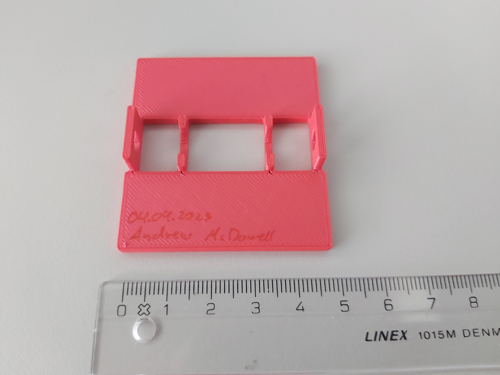
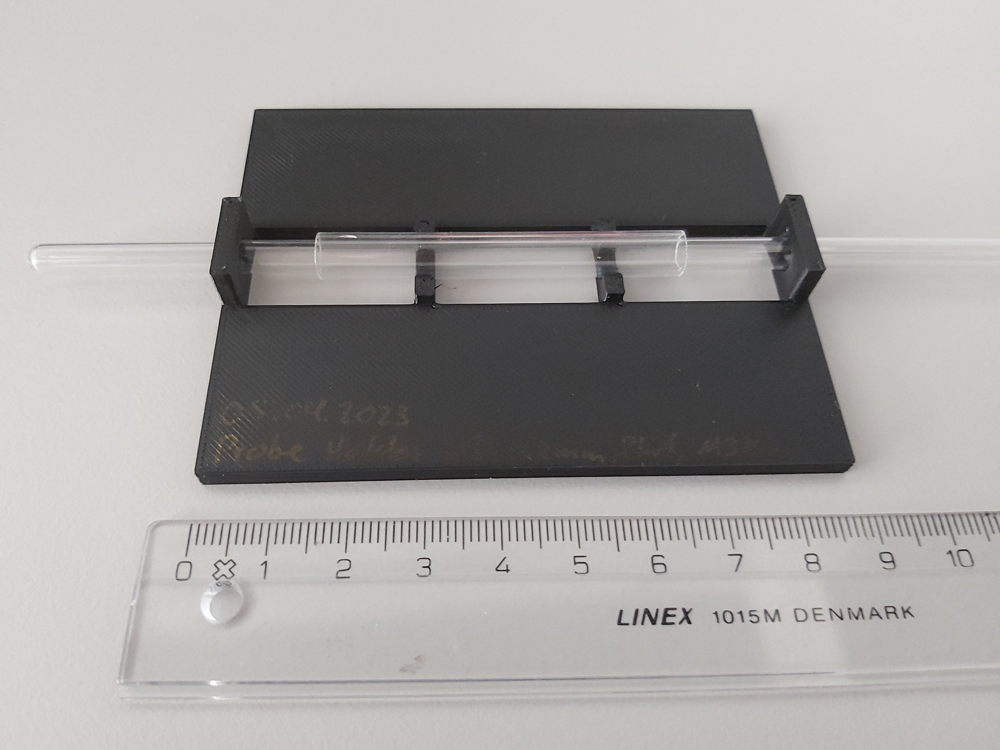
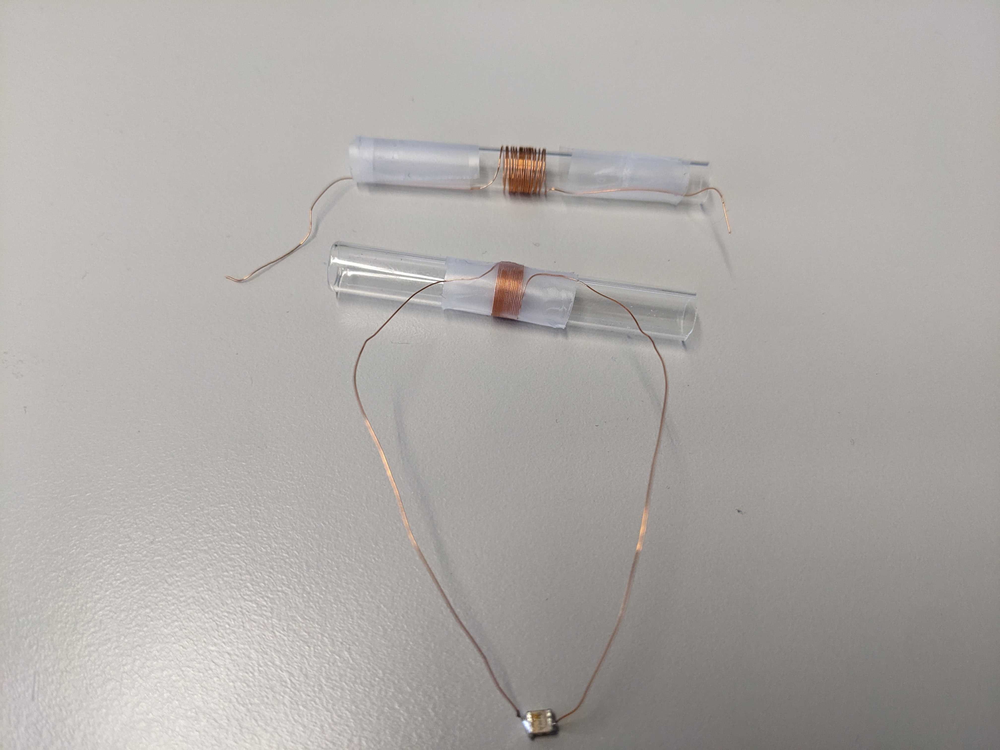

# NMR Probe

To measure a signal an NMR probe holder is needed that fulfils two tasks:
1. Position the sample correctly in the central homogenous region of the magnet (~6mm diameter sphere)
2. Carry the rf coil for sending and receiving the electromagnetic pulse

To this end, a custom probe for the NMR has to be made.

## Andrew McDowell's NMR probe

### Body

To evaluate the performance (i.e specification) of the magnet, NuevoMRSABR has performed a [crude probe that fits 5mm NMR tubes](../../literature/SABR_Permanent_Magnet_and_Shim/ETH%200.6%20T%20Final%20Report_202301.pdf)

!TODO: Insert my own picture of Andrew's NMR Probe here.

As a first attempt, the same probe holder was 3D printed on a Prusa MK3S MMU2S with 0.3mm PLA on the "DRAFT" setting of the printer in about 26 minutes. The print of which can be seen here:

This first print turned out ok, but small gaps can be noticed where the actual tube holders connect to the plates. A smaller print diameter should thus be chosen for the next print.

We then decided that it would be beneficial for the NMR probe to occupy the whole space within the magnet, i.e. to be flush on all sides such that the centre of the is automatically aligned with the centre of the magnet. Andrew's Probe only has dimensions 50mm x 55mm x 9.5mm.

### Coil

The coil consists of approx. ~0.2mm insulated copper wire wrapped around a clear plastic tube in 18 turns on a length of 6mm with a diameter of 7.5mm resulting in a theoretical inductance of 3.00uH when assuming a mu_r of 1 for the inside. Thus expecting an NMR signal from about 8mm long.

Since Andrew sent us his probe we also were able to measure his values, but only inside the circuit (i.e. with tuning and matching capacitances attached) making the results inaccurate.When measured with an PM6303 RCL meter the coil had an inductance of 2.3uH @ 1kHz.

## Probe Holder v1

### Body

Since we only had the *.stl object file of Andrew's NMR probe, the subsequent probe was then redesigned using openSCAD - an open-source solid 3D CAD modeller with its own programming language. [The source](./probe_holder_v1/230403-probe_holder_v1.scad) can be easily modified, parameterized and since it is open-source - easily reproduced.

The design for this first version stayed the same, the probe holder also accepts 5mm tubes and a 7.5mm tube for the coil - merely the outer dimensions have been increased.

The resulting \*.scad file was exported to \*.stl, sliced with Prusa Slicer and printed this time with 0.2mm PLA in about 1.25 hours on a Prusa M3KS printer with the "QUALITY" setting.

The resulting part has exactly the dimensions of the free space of the magnet: 70mm x 83.35mm x 10mm and fits flush inside.

### Coil

The coil was wrapped around a 7.5mm glass tube with 0.2mm diameter insulated copper wire on a length of 4mm. With 18 turns this results in a theoretical inductance of 4.5uH.

When measured with an HP4284 LCR-Meter resting on a styrofoam box we obtained the following measurements:

| Frequency [kHz] | Inductance [uH] | Resistance [Ohm] |
| --------------- | --------------- | ---------------- |
| 0.1             | 0.4             | 0.437            |
| 1               | 5.35            | 0.437            |
| 10              | 3.04            | 0.530            |
| 100             | 2.70            | 0.437            |
| 1000            | 2.74            | 0.627            |

The variability can be explained by stray capacitances of the connection wires, between the individual windings and the surroundings.

To get a better idea of how the coil behaves near the target resonance frequency of 25.01MHz (set by the magnet) a resonant circuit was formed by connecting a 10pF capacitance to both ends. See the bottom coil here:

The resonant frequency of this setup was then measured with a Rhode&Schwarz ZNB4 vector network analyser (VNA) and a connected pickup coil held near the circuit. We estimated the resonant frequency to be 29.6MHz. With the formula of the resonance frequency of a coil and capacitance of $f_{res} = \frac{1}{2\pi\sqrt{LC}}$ we estimated the inductance to be $L = \frac{1}{4\pi^2f_{res}^2C} = 2.89\textrm{uH}$, which is close to the expected value when looking at the measurements above, but quite far (~35% smaller) from the calculated expectation of 4.5uH.

A "variable pitch coil" with changing density of windings (tighter at both edges, looser at the centre) could later be investigated for a more homogenous field inside the coil.
